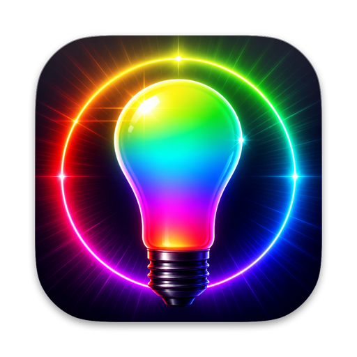

# OpenHue app icon



A Philips Hue "spectrum" light bulb (amber → magenta → violet → cyan, lit from inside)
on a deep indigo → near-black background, composited onto Apple's macOS app-icon grid
with a Liquid-Glass-style top sheen and rim light.

## Files

| Path | What |
|---|---|
| `icon-1024.png` | 1024×1024 RGBA master on Apple's grid: 824×824 continuous-corner squircle centred with a 100 px transparent margin, corner radius 185 px, soft drop shadow inside the margin. |
| `AppIcon.iconset/` | All ten standard sizes (16, 32, 128, 256, 512 at 1× and 2×) downscaled from the master with `sips`. |
| `../AppIcon.icns` | The bundle icon built from the iconset with `iconutil` (lives at the project root). |
| `preview-512.png` | 512 px render of the master, used above. |
| `source/artwork.png` | The raw full-bleed 1024×1024 artwork (variant A) generated by Codex. Input to the compositor. |
| `source/alternates/` | The two other Codex candidates (B: white bulb with a hue-wheel halo, C: spectrum bulb with Bluetooth-style arcs) in case the direction changes. |
| `render.swift` | The compositor (AppKit/CoreGraphics script): squircle mask, margin, shadow, sheen, rim light. |
| `build.sh` | One-shot pipeline: `render.swift` → iconset → `.icns` → preview, then verifies the `.icns` round-trips. |
| `generate-artwork.sh` | The exact Codex image-generation prompt used for the artwork (variants A/B/C). |

## How it was made

1. **Artwork** — three candidate full-bleed artworks were generated with the Codex CLI's
   built-in image generation, dispatched through the `codex-design-handoff` Claude Code skill
   with the `brandkit` taste skill prepended (`generate-artwork.sh` holds the prompt, verbatim).
   Variant A (spectrum-filled glass) was chosen because it keeps a recognisable bulb silhouette
   down to 32 px, whereas B collapses into a white dot inside a coloured ring at small sizes and
   C's arcs read as clip-art and vanish when downscaled.
2. **Compositing** — `render.swift` places the artwork on the grid. The squircle is built with the
   figma-squircle continuous-corner construction (radius 185 px, smoothing 0.6) rather than a
   plain rounded rect. The artwork is scaled to 1.10 × 824 px and cropped so the bulb occupies
   about 75 % of the tile height (Apple's inner-circle proportion). On top: a 13 % white sheen
   fading out over the top 40 %, a faint bottom-edge darkening, and a 2 px inner rim light that is
   bright along the top edge and fades to nothing by the bottom. The drop shadow is offset 10 px
   down with a 22 px blur, well inside the 100 px margin.
3. **Sizes** — `build.sh` runs `sips -z` for each iconset size and `iconutil -c icns`.

## Regenerating

```sh
# recomposite from the existing artwork and rebuild every size + the .icns
Icon/build.sh

# tweak the crop-in (1.0 = artwork exactly fits the squircle)
ART_SCALE=1.0 Icon/build.sh

# regenerate the raw artwork with Codex (needs the codex CLI + codex-design-handoff skill),
# then move the PNG it writes to Icon/source/artwork.png and run build.sh again
Icon/generate-artwork.sh A      # or B / C
```

`render.swift` can also be run directly: `swift Icon/render.swift <artwork.png> <out.png> [--scale 1.10] [--no-shadow]`.
The grid constants (`inset`, `side`, `cornerRadius`, `cornerSmoothing`) and the sheen/shadow
strengths are named at the top of the script.

## Using it in the app

* SwiftPM / plain bundle: reference `AppIcon.icns` from `Info.plist` via `CFBundleIconFile`
  (value `AppIcon`), and copy the file into `Contents/Resources/`.
* Xcode asset catalog: drag the ten PNGs in `AppIcon.iconset/` into an `AppIcon` image set, or
  add `icon-1024.png` as the single 1024 pt "App Icon" slot and let Xcode derive the sizes.
