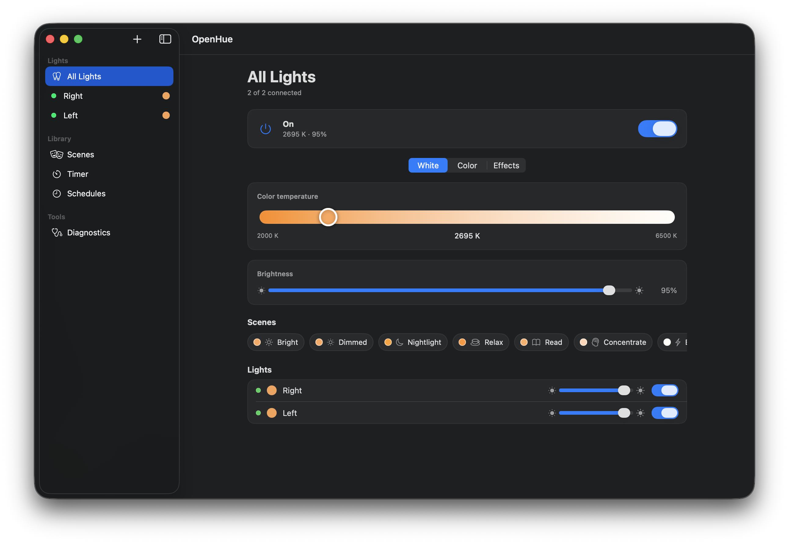
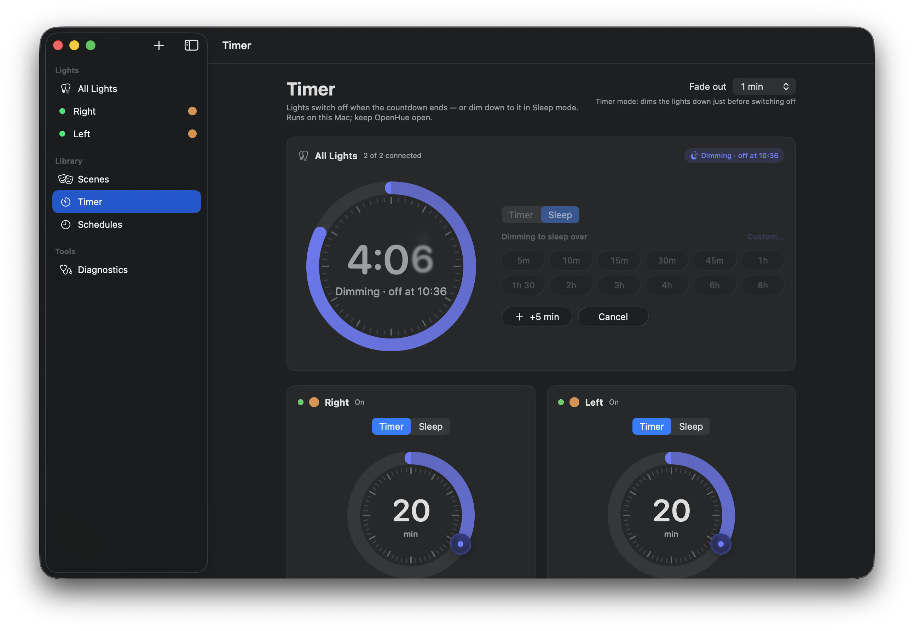
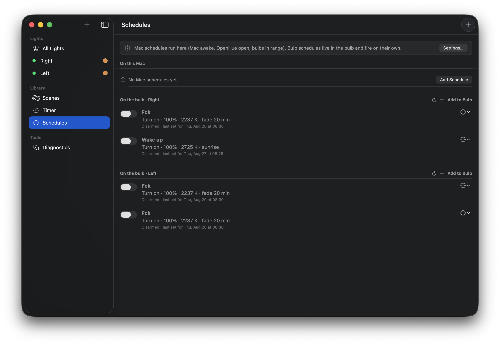
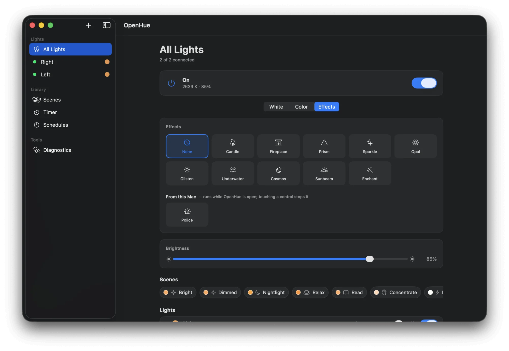
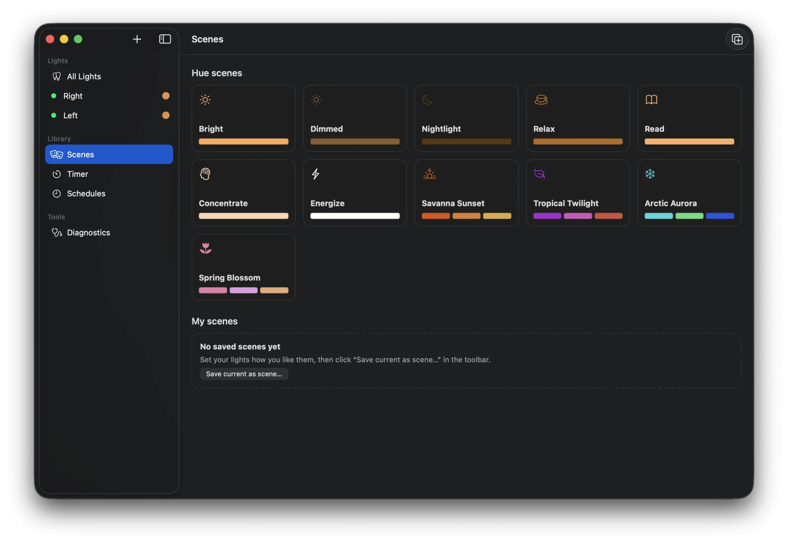
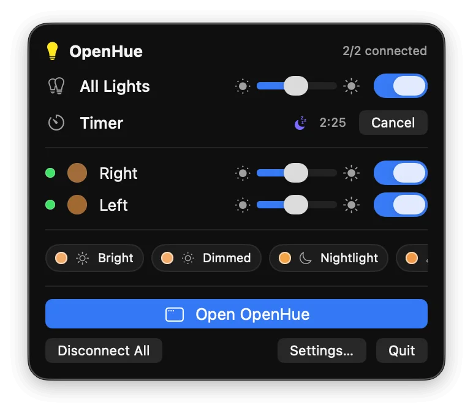
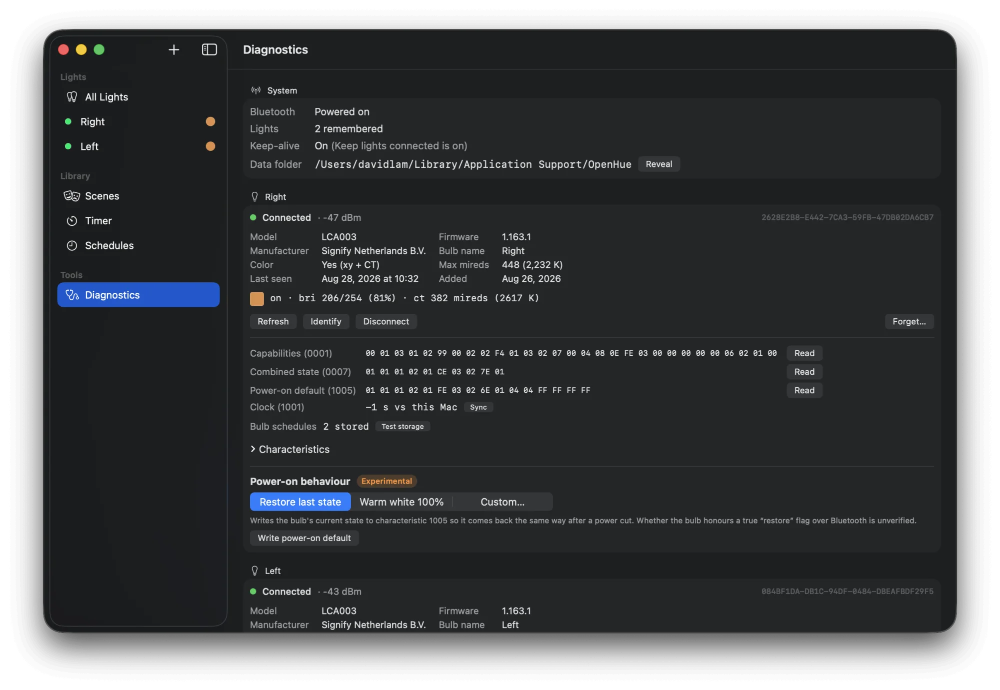

<p align="center"></p>

# OpenHue

A native macOS app that controls Philips Hue **Bluetooth** bulbs directly over BLE — no Hue Bridge, no cloud, no phone. Swift / SwiftUI / CoreBluetooth, macOS 14+.

<p align="center"></p>

## What it is

Hue bulbs sold in the last few years contain a Bluetooth radio that Signify uses for the "Hue Bluetooth" phone app. OpenHue talks the same GATT protocol from your Mac: it discovers bulbs, pairs with them, reads and writes their state, and runs schedules on the Mac's clock. Everything stays local.

## Features

- Discover and pair bulbs, remember them across launches, keep them connected for instant commands.
- Per-light power, brightness, colour temperature, xy colour and the bulb's built-in effects (candle, fireplace, …).
- **Police** effect — red/blue strobe driven by the Mac, alternating between bulbs like a light bar (Effects tab → "From this Mac"); any manual change stops it and restores the previous state.
- "All lights" controls, plus a menu-bar extra for quick access.
- Scenes: Hue's stock scenes (Bright, Relax, Energize, Savanna Sunset, …) and your own snapshots ("Save current as scene…").
- **Timer** tab: a rotary time dial (one turn = an hour, keep turning for more) with 5 min … 8 h presets and a custom entry — one countdown for All Lights and one per bulb. **Timer** mode switches the lights off at the end (with a short fade-out); **Sleep** mode dims them gradually over the whole countdown, like a real sleep timer. Survives a relaunch and keeps the Mac awake until it fires.
- Schedules: weekly or one-off, turn on/off, **wake-up fade-in** and **go-to-sleep fade-out**, targeting all lights or a subset.
- **Schedules stored on the bulb**: OpenHue writes wake-up / turn-off schedules into the bulb's own memory, where they fire on the bulb's clock with no Mac and no phone around — and it shows, arms, disarms and deletes the routines the Hue app created. First third-party client to do this (the "MAC-protected" create packet turned out to carry a plain UUID v4).
- Launch at login, keep-the-Mac-awake assertion, and an optional `pmset` scheduled wake so a laptop can run a morning schedule.
- Diagnostics view: raw characteristic dump, raw read/write, power-on default, bulb clock, live log.

<table>
  <tr>
    <td align="center"><b>Timer</b> — dial, Timer / Sleep modes, one countdown per bulb</td>
    <td align="center"><b>Schedules</b> — stored on the bulb, fired by its own clock</td>
  </tr>
  <tr>
    <td></td>
    <td></td>
  </tr>
  <tr>
    <td align="center"><b>Effects</b> — the bulb's own plus Police from this Mac</td>
    <td align="center"><b>Scenes</b> — Hue's stock scenes and your own snapshots</td>
  </tr>
  <tr>
    <td></td>
    <td></td>
  </tr>
</table>

## Limits

- **Bluetooth range.** Bulbs must be within BLE range of the Mac (a room or two; walls hurt).
- **One connected device per bulb.** While this app is connected the Hue phone app can't reach the bulb, and vice versa. Use *Disconnect All* (Settings → Data, or the menu bar) to hand a bulb over.
- **Bulb schedules are one-shot.** The bulb disarms a schedule after it fires (the Hue app quietly re-arms its routines every time it connects). OpenHue does the same with **Re-arm every day** — it only needs to connect once between two occurrences. See [Schedules](#schedules).
- **Bridge-joined bulbs are unsupported.** Once a bulb has joined a Hue Bridge (Zigbee) its Bluetooth control is disabled. Remove it from the Bridge or factory-reset it.
- **Renaming is best effort.** The name is stored locally and also written to the bulb's name characteristic, which some firmware ignores.

## Install

Grab `OpenHue.zip` (or the `.dmg`) from the [latest release](https://github.com/dw2lam/OpenHue/releases/latest), unzip, and drag **OpenHue.app** to `/Applications`.

The build is signed with an Apple *Development* certificate, not a notarized Developer ID, so on first launch Gatekeeper will refuse it. Either **right-click → Open → Open**, or clear the quarantine flag once:

```sh
xattr -dr com.apple.quarantine /Applications/OpenHue.app
```

Then follow [First launch](#first-launch). To build from source instead, see [Build & run](#build--run).

## Build & run

Requirements: Xcode 26 (Swift 6 toolchain, Swift 5 language mode), macOS 14 or later.

```sh
./make-app.sh          # builds build/OpenHue.app (release), signs with your Apple Development identity if one is present
open "build/OpenHue.app"
swift test             # protocol / colour-math / scheduler tests
```

Do **not** run the bare binary with `swift run`. The Bluetooth permission is attributed to the process that owns the TCC prompt — for a bare binary that is Terminal, not the app — and the executable has no `Info.plist` with the required `NSBluetoothAlwaysUsageDescription`, so CoreBluetooth reports `unauthorized`. Always launch the `.app` that `make-app.sh` produces.

## First launch

1. macOS asks *"OpenHue would like to use Bluetooth"* — click **Allow**.
   If you denied it (or it never appeared), enable the app under **System Settings → Privacy & Security → Bluetooth**, then relaunch.
2. Click **Add Light**. Power the bulb on and keep it within a couple of metres; it appears in the list with a signal indicator.
3. Click **Add**. The first command to the bulb triggers pairing — see below.

## Pairing

Hue bulbs pair implicitly: the first encrypted read makes macOS show a **Connection Request** dialog for the bulb. Click **Connect** (or **Pair**). After that the Mac remembers the bond and reconnects silently.

If the dialog never appears or pairing fails, the bulb is still bonded to your phone and is refusing new pairings. Bulbs only accept a new pairing while **discoverable**:

1. **Make the bulb discoverable from the phone — no Bridge needed, and the phone app keeps working.** In the Hue app go to **Settings → Voice Assistants → Amazon Alexa** (or **Google Home**) **→ Make Discoverable**. This is the same window Echo/Nest speakers use to pair with Bluetooth-only bulbs, and it's what OpenHue needs. Then, within a minute or two, click **Retry** in OpenHue (or add the light). If the phone app is still holding the connection, background it right after tapping Make Discoverable.
2. **Last resort — factory reset.** Switch the bulb off and on **5 times** (about a second apart), ending **on**; it blinks on the last cycle. This unpairs the phone app too and gives the bulb a **new Bluetooth address**, so it appears as a fresh "Hue Lamp": use **Add Light → "Add as replacement for…"** and pick the old entry (name, scenes and schedules carry over), then click **Connect** on the macOS Connection Request.
3. If macOS still refuses, forget any stale **"Hue Lamp"** entry in **System Settings → Bluetooth** (hover → ⓘ → Forget) and retry.
4. **Bulb joined to a Hue Bridge?** It cannot be controlled over Bluetooth at all. Delete it from the Bridge first.

The same steps are shown inside the app (Add Light → Pairing help, and in a light's detail view when pairing stalls).

## Timer

<p align="center"></p>

Going to bed? Open **Timer**, turn the dial (or tap **20m**, **1h**, **Custom…**), pick a mode and press **Start**. All Lights has its own timer and so does each bulb, so you can give the bedside lamp 20 minutes and leave the rest alone. While a timer runs the dial drains like a clock face and shows the exact switch-off time; **+5 min** pushes it out, **Cancel** stops it.

- **Timer** leaves the lights as they are and switches them off when the countdown ends, after the short **Fade out** you choose at the top of the page (off / 30 s / 1 min / 5 min / 15 min / 30 min; also in Settings → Schedules).
- **Sleep** starts dimming right away and takes the whole countdown to reach the minimum, then switches off — a real sleep timer for drifting off. Touching a light's controls during a fade stops the fade, not the timer.
- The timer runs on this Mac like schedules do, but it also holds a *keep-awake* assertion until it fires (Settings → Schedules to turn that off), so an idle Mac won't doze off before the lights do.
- Timers are saved to disk: quit and relaunch, and the countdown carries on. A deadline that passed while OpenHue wasn't running still switches the lights off if it is less than 30 minutes old; older ones are dropped so a stale bedtime timer can't kill the lights the next morning.
- The menu bar extra has **Off in…** / **Sleep in…** shortcuts for All Lights and shows the live countdown.

<p align="center"></p>

## Schedules

There are two kinds, side by side in the Schedules view.

### On the bulb

<p align="center"></p>

**Schedules → On the bulb → Add to Bulb** stores a schedule *inside the bulb*: a name, a time, and either *turn on* (brightness, warmth, optional fade-in up to 60 min) or *turn off*. The bulb keeps its own clock — OpenHue reads it on every connect and re-syncs it if it drifts by more than 20 s — and fires the schedule by itself, with the Mac asleep and the phone away. Routines created in the Hue phone app show up in the same list and can be armed, disarmed and deleted from here.

- A bulb schedule fires **once** and is then disarmed by the bulb. Leave **Re-arm every day** on and OpenHue arms it for the next day whenever it is connected (a wake-up that fired at 07:00 is re-armed for tomorrow the moment OpenHue next sees the bulb).
- A power cut stops the bulb's clock; OpenHue sets it again on the next connect, so keep *Keep lights connected* on if you rely on bulb schedules.
- Diagnostics has a **Test storage** button that stores a disarmed test schedule, reads it back and deletes it.

### On this Mac

Weekly or one-off schedules with fades and scenes run **on this Mac**. For one of those to fire:

- the Mac must be **awake** (not sleeping; the display may be off),
- **OpenHue must be running** — turn on **Launch at login** (Settings → General),
- the bulbs must be **within Bluetooth range**.

Helpers in **Settings → Schedules / Wake Mac**:

- **Keep this Mac awake while OpenHue is running** holds a `PreventUserIdleSystemSleep` assertion. Reliable on a desktop or a plugged-in laptop; on battery it costs power.
- **Wake this Mac** writes a `pmset repeat wakeorpoweron <days> <time>` entry (macOS asks for your administrator password once). The app suggests the union of your weekly schedule days at 2 minutes before the earliest one. A MacBook with the **lid closed** only wakes for this if it is on power **and** connected to an external display; otherwise open the lid. `pmset repeat cancel` removes *all* repeating pmset events, so check `pmset -g sched` if you use others.
- **Missed schedules.** If the Mac was asleep at the trigger time, an *on* schedule still runs when the Mac wakes within the grace window (default 30 min — a wake-up fade resumes mid-ramp), and an *off* schedule within its own window (default 6 h). Set either to 0 to disable.

Each row in the Schedules view shows the next fire time and the last outcome ("Ran 07:00", "Skipped — Mac was asleep 45 min", …).

## Roadmap

The plan is to make these Bluetooth-only bulbs first-class devices on a home server — a headless bridge daemon plus a Homebridge/HomeKit plugin, running on any nearby machine with Bluetooth — see [ROADMAP.md](ROADMAP.md).

## Data location

Everything lives in `~/Library/Application Support/OpenHue/` as plain JSON (`lights.json`, `scenes.json`, `schedules.json`, `sleep-timers.json`, `settings.json`), written atomically. Settings → Data → **Open folder** reveals it. Deleting the folder resets the app; the Bluetooth bonds themselves live in macOS (System Settings → Bluetooth).

## Troubleshooting

<p align="center"></p>

- **Diagnostics view** (sidebar) shows the Bluetooth state, each bulb's connection state, RSSI, firmware, decoded state, every characteristic with its last raw value, and a raw read/write box. The log panel at the bottom mirrors the app's unified log; **Copy** puts it on the clipboard.
- Same log from Terminal:
  ```sh
  log stream --predicate 'subsystem == "com.davidlam.openhue"'
  ```
- **Bulb shows "Not found — rescan"**: it isn't advertising. It is off, out of range, or connected to another device (the phone app). Power-cycle it once and click Rescan.
- **"Pairing failed"** or the Connection Request never appears: follow [Pairing](#pairing) — make the bulb discoverable from the phone app, or factory-reset and re-add it as a replacement.
- **Stale bond**: after a factory reset macOS may still hold the old pairing. Forget "Hue Lamp" in System Settings → Bluetooth, then add the bulb again.
- **Commands feel slow**: enable *Keep lights connected* (Settings → General). Otherwise the app connects on demand (a few seconds).
- **Schedule didn't run**: check the row's last outcome, then Settings → Schedules (keep awake / grace windows) and Wake Mac (`pmset -g sched`).

## Protocol notes

Bulbs advertise the Signify 16-bit service UUID `FE0F` (in `serviceUUIDs` or `serviceData`). Once connected, the light service is `932c32bd-0000-47a2-835a-a8d455b859dd`; characteristics share that base and differ in the second group:

| Characteristic | UUID (`932c32bd-XXXX-47a2-835a-a8d455b859dd`) | Format |
|---|---|---|
| Capabilities | `0001` | 15 bytes, read-only (likely TLV with mireds range — dump it in Diagnostics) |
| Power | `0002` | 1 byte, `00`/`01`; R/W/Notify. Reading it is what triggers the pairing dialog |
| Brightness | `0003` | 1 byte, `1…254` (never write `0`); R/W/Notify |
| Colour temperature | `0004` | `uint16` little-endian mireds `153…500` (454 on some models); reads `FFFF` while in xy mode |
| Colour xy | `0005` | 2 × `uint16` LE = `round(x·65535)`, `round(y·65535)`; reads `FFFFFFFF` while in CT mode |
| Alert | `0006` | write-only: `00` none, `01` flash once, `02` flash repeatedly |
| Combined state | `0007` | TLV `[tag][len][value]…`: `01` on, `02` brightness, `03` mireds, `04` xy, `06` effect, `08` effect speed; R/W/Notify — the one read that returns the whole state |
| Power-on default | `1005` | same TLV as `0007` followed by `FF FF FF FF`; R/W |

Other services:

| Service / characteristic | UUID | Notes |
|---|---|---|
| Device configuration | `FE0F` | name `97fe6561-0003-4f62-86e9-b71ee2da3d22` (ASCII, R/W best effort), Zigbee address `97fe6561-0001-…` (8 bytes), pairing control `97fe6561-2001-…` |
| Device Information | `180A` | manufacturer `2A29`, model `2A24`, firmware `2A28` |
| Bulb clock | `97fe6561-1001-…` | `uint32` LE Unix epoch seconds (UTC); R/W/Notify. Undocumented until now — found by reading every characteristic and spotting the one that equals `date +%s`. The alarm timestamps below are compared against it |
| On-bulb alarms | `9da2ddf1-0001-44d0-909c-3f3d3cb34a7b` | request/response over one Write+Notify characteristic — see below |

Alarm requests: `00` list ids → `00 status ?? count id16…`; `02 id16 00 00` detail → `02 status id16 len 00 00 00 body`; `01 id16 body` write (`id16 = FFFF` creates; ack `01 status FFFF newId16`, then a `04 …` commit notification); `03 id16` delete → `03 status id16`, then `04 id16 FF FF`. Body layout:

```
[flag][enabled][kind][fireAt u32 LE]          kind 0 = routine, 1 = countdown timer
[actionType][len][action…]                    0 = light-state TLV as in 0007 (+ tag 05 = transition in 100 ms units), 1 = one-byte code
[blockLen][01][uuid 16 bytes]                 blockLen counts from the 01 to the end
[trailerType][u32 LE]                         00 FFFFFFFF = none, 03 seconds = countdown duration
[nameLen][name][trailing = enabled]
```

The 16 bytes were assumed for years to be an app-generated MAC that made creation impossible. Every captured sample has the RFC 4122 version-4 nibble and variant bits: it is a client-minted **UUID v4**, nothing more. OpenHue mints one per schedule and the bulb stores it (verified on LCA003 firmware 1.163.1). Routine timestamps are the *start of the fade*, not the target time.

Effects (tag `06`): `01` candle, `02` fireplace, `03` prism, `0A` sparkle, `0B` opal, `0C` glisten, `0E` underwater, `0F` cosmos, `10` sunbeam, `11` enchant.

Credit: the protocol was reverse-engineered by the community — chiefly [flip-dots/HueBLE](https://github.com/flip-dots/HueBLE) and [glyphack/huec](https://github.com/glyphack/huec) (whose packet captures made the alarm layout and the UUID finding possible), with macOS pairing notes from ai212983/blemacd. This project is not affiliated with Signify / Philips Hue.
